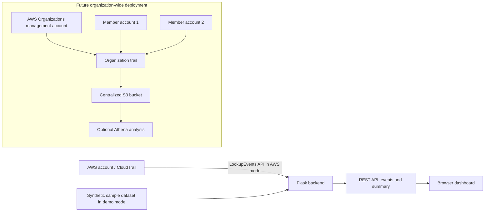

# CloudTrail Central — Multi-account Log Aggregation

**Project code:** 24C3014-P065  
**Team:** Y24-SAA-Team206  
**Stack:** Python Flask, Boto3, AWS CloudTrail, AWS IAM; optional S3/Organizations/Athena extensions.

## Honest implementation status

This repository contains a runnable Flask dashboard with synthetic demo events and an optional read-only integration with the CloudTrail `LookupEvents` API for the configured AWS account and region.

- Demo mode is enabled by default. Sample events are explicitly labeled and are **not AWS deployment evidence**.
- AWS mode queries the configured account/region. It does **not** claim organization-wide aggregation.
- Organization-wide collection requires an AWS Organization, access through its management account or authorized delegated administrator, and a configured organization trail. This cannot be proven with only one standalone AWS account.

## Features

- Summary cards: event count, account IDs represented, and events flagged for review.
- Search by event, service, username, account, and status.
- Status filter and event JSON inspection.
- REST endpoints: `/api/health`, `/api/summary`, `/api/events`.
- Synthetic demo mode for offline review preparation.
- Optional Boto3 CloudTrail lookup mode.

## Requirements

- Python 3.10+
- AWS credentials only if using AWS mode.
- An AWS Region enabled for your account.

## Run locally (demo mode)

```bash
python -m venv .venv
# Windows PowerShell:
.venv\\Scripts\\Activate.ps1
# macOS/Linux:
# source .venv/bin/activate

pip install -r requirements.txt
copy .env.example .env
# Windows: copy .env.example .env
python app.py
```

Open http://127.0.0.1:5000

For Windows, if `copy` is not recognized in your shell, create `.env` by copying `.env.example` in File Explorer.

## Run tests

```bash
pytest -q
```

## Enable account-level CloudTrail lookup

1. Configure AWS credentials using an approved method, preferably an IAM role/profile or environment credentials. Do not hardcode access keys.
2. Ensure the identity has permission for `cloudtrail:LookupEvents`.
3. Edit `.env`:

```env
DEMO_MODE=false
AWS_REGION=ap-south-1
```

4. Run `python app.py` and use Refresh data.

`LookupEvents` is a recent management-event lookup API and returns at most 50 events per call in this prototype. This implementation does not paginate. Refer to AWS documentation for the API's time range, supported filters, and request limits.

## Architecture



## Security and safety notes

- Never commit `.env`, AWS access keys, session tokens, or customer log files.
- CloudTrail logs can contain sensitive identity and resource information; restrict access and follow least-privilege practices.
- Do not create an Organization or incur AWS charges just for a class demo without approval.
- The `REVIEW` label is a simple illustrative heuristic, not a validated threat-detection system.
- The local development server binds to `127.0.0.1`; do not expose it publicly without authentication, authorization, HTTPS, input controls, and deployment hardening.

## Suggested project structure

```text
cloudtrail-log-aggregator/
├── app.py
├── templates/index.html
├── static/style.css
├── tests/test_app.py
├── requirements.txt
├── .env.example
├── .gitignore
├── docs/
│   ├── proposal.md
│   ├── midterm-review.md
│   └── viva-and-demo.md
└── README.md
```

## Review evidence checklist

Record only what you personally execute and observe:

- [ ] Application starts locally.
- [ ] Dashboard loads in demo mode.
- [ ] Search and status filtering work.
- [ ] Tests pass; paste actual output into your report.
- [ ] If AWS mode is tested, record the region, time, and redacted evidence.
- [ ] Organization-wide trail and S3 delivery remain **not implemented / not verified** until genuinely configured and tested.
